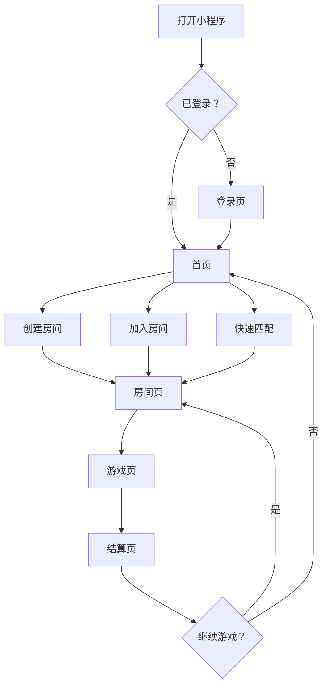
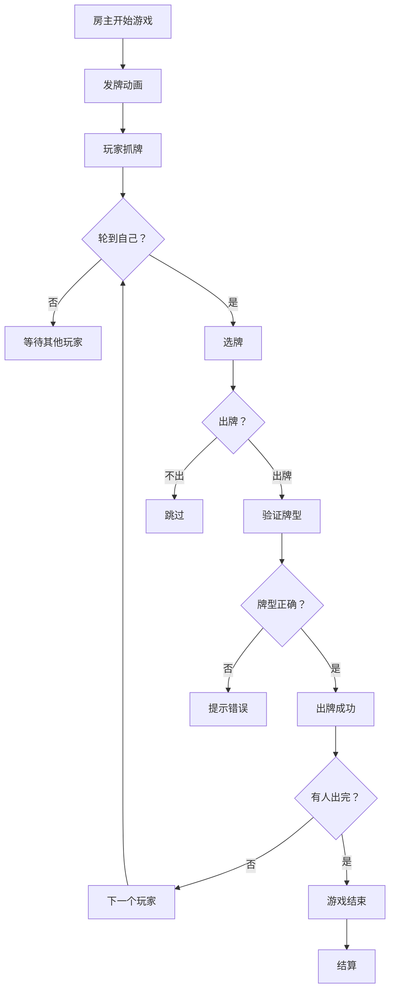
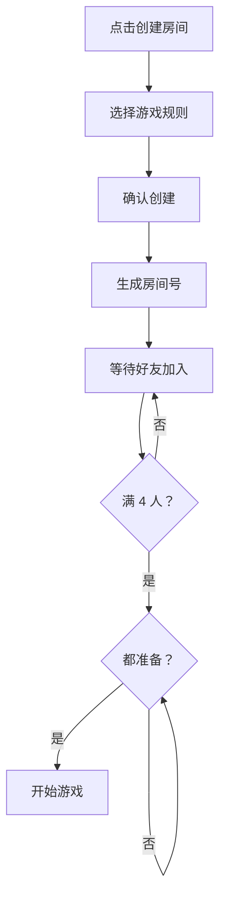
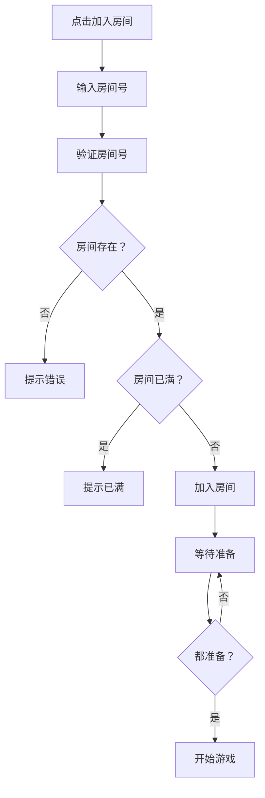
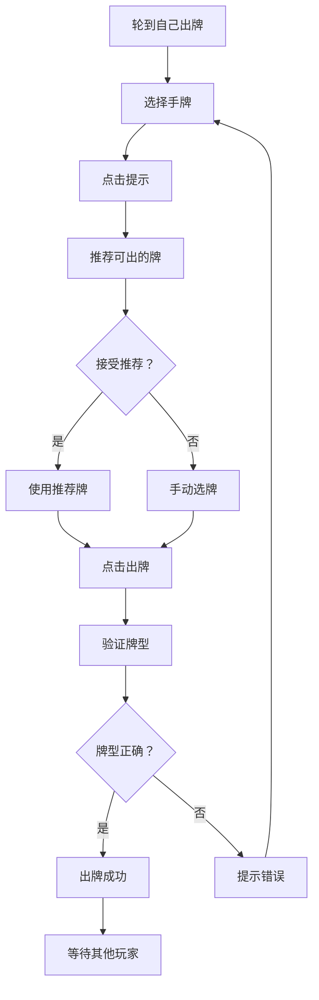
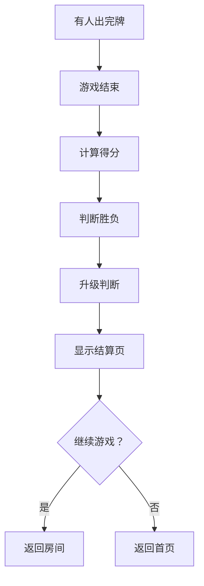

# 掼蛋大师 v2.0 - 用户流程图

**版本**: v1.0  
**创建日期**: 2026-03-28  
**创建人**: product-agent  

---

## 📊 整体流程



---

## 🎴 游戏流程



---

## 🏠 创建房间流程



---

## 🚪 加入房间流程



---

## 🎮 出牌流程



---

## 📊 结算流程



---

## 📋 流程检查清单

### 登录流程
- [x] 新用户注册流程
- [x] 老用户登录流程
- [x] 授权失败处理

### 房间流程
- [x] 创建房间流程
- [x] 加入房间流程
- [x] 房间满员处理
- [x] 玩家准备流程

### 游戏流程
- [x] 发牌流程
- [x] 出牌流程
- [x] 牌型验证流程
- [x] 游戏结束流程

### 结算流程
- [x] 计分流程
- [x] 升级流程
- [x] 继续游戏流程

---

## ⚠️ 边界情况处理

### 网络异常
```
出牌时断网 → 提示"网络异常" → 自动重连 → 恢复游戏状态
```

### 玩家退出
```
游戏中退出 → 判负 → 托管继续 → 游戏结束
```

### 超时处理
```
轮到自己超时 → 自动托管 → 出最小牌
```

---

**用户流程图完成时间**: 2026-03-28 14:00 PM  
**下一步**: 内部评审
